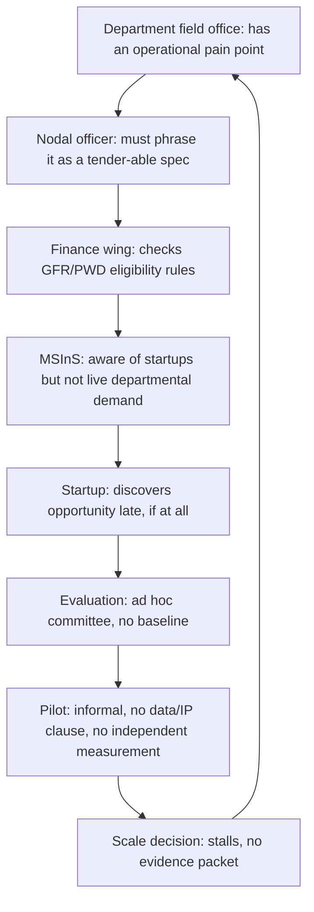

# PS 26136 — Startup-Friendly Public Procurement (Maharashtra)

## Research & Strategy Brief

Sep 22, 2026 · prepared for @Pankaj Kumar

## 1. Problem Reframe

**Plain-language restatement.** Maharashtra departments cannot legally or administratively "just buy" from a promising startup the way a private company could. Standard tendering (GFR-based, GeM-based, or state PWD/works-manual based) is built around L1 lowest-price bidding, multi-year turnover proof, and pre-existing product catalogues. Startups routinely fail eligibility screens before anyone evaluates whether their solution actually works, and departments have no low-risk, time-boxed way to try an unproven solution before committing budget to it.

**Real root problem vs. stated problem.** The stated problem is "procurement rules are unfriendly to startups." The actual operational bottleneck is narrower and more structural: India already has the legal relaxations needed (GFR Rule 173(i), Rule 170(i), state startup policies) — what is missing is the operational machinery to convert a relaxation into a repeatable pilot-to-scale pathway. No department official currently has a standard, low-personal-risk process to: (a) turn a vague operational pain point into a fundable, outcome-based problem statement; (b) legally run a small paid pilot with an unproven vendor without violating audit norms; (c) independently verify pilot results before a scale-up procurement decision; and (d) manage data/IP ownership when a startup's IP was built partly on government data. Because this machinery doesn't exist, department officials default to the safest path — do nothing, or wait for a startup to already have three years of billing history elsewhere.

**Who suffers, how often, where, why.**

- Startups — every funding cycle, statewide, because government is a credible anchor client and reference customer they cannot access; long sales cycles (often 12–24 months) burn runway.
- Departments/field offices — every time an operational gap (irrigation monitoring, waste segregation, last-mile grievance tracking, etc.) could be solved cheaply by an existing Indian startup product but the tender desk cannot justify a non-standard purchase.
- Citizens/end beneficiaries — indirectly, through delayed modernisation of public services.
- Auditors/finance officers — face personal liability risk (CAG objections, vigilance queries) for any procurement decision that later looks like favouritism, which is precisely why they avoid discretionary relaxations even when legally permitted.

**Direct, indirect, government and field-level users.**

- Direct: department nodal officers who own a problem statement; DPIIT/MSInS-recognised startups bidding to solve it.
- Indirect: end citizens/field beneficiaries of the piloted solution; competing established vendors who must see a fair process.
- Government users: MSInS as the nodal innovation agency; department finance/procurement wings; state IT department for data/cybersecurity sign-off; CAG/local fund audit.
- Field-level users: the frontline staff (gram sevak, ward officer, PHC nurse) who actually operate the piloted tool day to day and whose adoption or rejection determines whether the pilot "succeeds" on paper but fails in practice.

## 2. Ground Reality Map

Flow of a startup-procurement attempt today:

| Actor | Role | Current pain | Data they create/need | Decision they make | Incentive / resistance | Failure if they don't act |
| --- | --- | --- | --- | --- | --- | --- |
| Department nodal officer | Owns the operational problem | Cannot write an outcome-based spec that survives audit; fears vigilance/CAG queries for favouring an unproven vendor | Problem context, baseline metrics, budget head | Whether to open a challenge at all | Career risk outweighs efficiency gain | Problem stays unsolved; reverts to legacy vendor |
| Finance / procurement wing | Certifies legal compliance | Knows GFR 173(i)/170(i) exist but has no standard template to apply them without personal sign-off risk | Eligibility checklist, waiver justification | Approve/reject the relaxation | Rule-following is safer than judgment | Relaxation never invoked even though legal |
| MSInS (nodal innovation agency) | Curates ecosystem, runs Startup Week | Runs one-time annual exposure, no live department-owned demand pipeline | Startup registry, sector tags | Which startups get exposure/work orders (up to Rs 15L) | Wants demonstrable pilots for state reporting | Startups get one-shot exposure, not a repeatable pathway |
| Startup | Builds the solution | Cannot meet turnover/experience filters; 12-24 month sales cycle; no demand visibility | Product specs, past pilot evidence, pricing | Whether to spend scarce runway chasing a government sale | Government is high-value but high-cost-to-acquire | Startup exits the public sector market |
| Technical evaluator | Assesses if solution is real | Ad hoc committees, no standard scoring rubric or conflict-of-interest process | Eval criteria, live test results | Pass/fail on technical merit | No fee or formal mandate in most departments | Evaluation quality varies; disputes unresolved |
| Field pilot site (PHC, gram panchayat, ward office) | Actually uses the piloted tool | Never consulted on operational fit before pilot design | Usage logs, feedback, exceptions | Whether to actually use the tool daily | No incentive tied to pilot success | Pilot looks successful on paper but fails in the field - the most common false positive |
| Independent validator | Confirms results before scale-up | Does not exist as a defined role today | Verified outcome data vs vendor-reported data | Recommend scale, extend, or terminate | No such role is funded or mandated | Scale decisions rest on vendor-supplied numbers |
| CAG / local fund audit | Reviews decisions post-facto | Flags any departure from L1 bidding lacking a documented rationale | Procurement file, evaluation trail | Whether the decision was defensible | Mandate to protect public money | A legal relaxation gets flagged anyway - the top reason officers avoid GFR 173(i) |

## 3. Existing Ecosystem & Competitor Audit

| System | What it solves | Who uses it | Adoption evidence | Limitation | Why it doesn't close this gap |
| --- | --- | --- | --- | --- | --- |
| [GeM Startup Runway 2.0](https://www.startupindia.gov.in/content/sih/en/public_procurement.html) | Lets DPIIT startups list and sell without prior turnover/experience/EMD | Startups selling standard/near-standard products nationwide | Startup procurement on GeM crossed roughly Rs 19,000 crore in FY 2025-26, up over 36% YoY | Built for *catalogue* goods/services, not for piloting an unproven, department-specific workflow solution; no challenge-authoring, evaluation, or pilot-to-scale layer | Solves market *access* for mature products, not the *discovery-to-pilot-to-scale* journey for a first-of-its-kind solution to a specific department's problem |
| [GFR Rule 173(i) / 170(i)](<https://www.startupindia.gov.in/content/dam/invest-india/Templates/public/General%20Financial%20Rules%20(GFRs)%20%E2%80%93%20Brief%20&%20certain%20exemptions.pdf>) | Legally exempts DPIIT startups from prior-turnover, prior-experience and EMD conditions | Any Central/State department, when invoked | Upheld in at least one High Court/tribunal challenge (PGIMER case) as lawful when documented | Purely a legal permission; provides no template, evaluation rubric, or audit-proof process for officers to actually use it | This is the enabling *law*, not the missing *mechanism* — officers avoid using it because there is no standard way to invoke it without personal audit risk |
| [Maharashtra Startup Week (MSInS)](https://www.incorpx.io/grants/providers/maharashtra-state-innovation-society) | Annual event; winning startups get direct government work orders up to Rs 15 lakh to pilot with a department | Maharashtra DPIIT/MSInS-registered startups | Recurring annual programme with direct work-order conversion, MSInS's flagship mechanism | One-time annual cohort; no year-round problem-statement pipeline; no documented milestone-based contracting, IP/data clause templates, or independent validation before scale-up | Closest existing analogue to this problem statement, but it is an *event*, not an *institutionalised, always-on procurement pathway* — it does not solve discovery for departments that miss the annual window, nor does it specify how a Rs 15L pilot converts into a compliant scaled contract |
| [MSInS Seed Fund / Maha-Fund](https://www.startupgrantsindia.com/providers/maharashtra-state-innovation-society) | Early-stage equity-free funding (up to Rs 10L) | Pre-revenue Maharashtra startups | Active, ongoing scheme | Funding instrument, not a procurement instrument — does not create a government customer relationship | Solves capital access, not demand access |
| [Atal Innovation Mission — ARISE / Atal New India Challenges](https://officerspulse.com/?p=31562) | Central-government sector challenges (Defence, Health, Housing, Food Processing) with grants up to Rs 50L–1Cr for prototype-to-product development | Startups/MSMEs nationally, ministry-specific | Over 24 ANIC challenges run across five ministries | National-ministry scope, not built for state-department operational problems; grant-based, not a procurement/contracting pathway; no state-level replica for Maharashtra departments | Proves the *challenge + staged-funding* model works at Central level, but Maharashtra departments have no equivalent state instrument tied to actual procurement |
| Rajasthan iStart / other state startup portals | Single-window startup registration, incubation and some department linkage | State-registered startups | Rajasthan iStart is widely cited as a leading state startup portal | Portal-first design (registration, discovery); pilot/procurement conversion into department budgets is not standardised or publicly documented at scale | Same category as MSInS's own portal — visibility and registration, not an end-to-end contracting pathway |
| Ministry of Defence 'Make-II' procedure | Procurement pathway for industry-funded prototype development in defence | Defence-sector startups/MSMEs | Established Central procedure, cited by Startup India as a public-procurement best practice | Sector-specific (defence only), heavy documentation, long timelines by design | Shows a *sector* can build a dedicated innovation-procurement procedure; Maharashtra has no cross-department equivalent |
| International: [UK Small Business Research Initiative (SBRI)](https://www.gov.uk) / US SBIR | Government posts real operational problems as funded challenges; phased contracts (feasibility -> prototype -> pilot) with milestone payment, no equity taken, IP typically stays with the company | Small/early-stage firms domestically | Decades-long running programmes, credited with de-risking public-sector innovation adoption in both countries | Not directly transferable — different procurement law, currency of contract sizes, and audit culture | The *structural template* worth adapting: outcome-based challenge -> phased, milestone-paid contract -> independent evaluation -> optional follow-on contract. Nothing in India today operationalises this template at state-department level with a defined data/IP and audit-evidence layer |

**What already exists, what is missing, and why the gap still matters.** Maharashtra already has (a) the legal relaxations (GFR 173(i)/170(i)), (b) a marketplace for mature products (GeM Startup Runway), (c) an annual discovery-and-work-order event (Startup Week), and (d) early-stage capital (Seed Fund). What does **not** exist anywhere in this stack — state or central — is the connective institutional layer between them: a standing, year-round system that (1) helps *any* department author a fundable outcome-based problem statement at *any* time, not just during Startup Week; (2) runs a controlled, milestone-paid, time-boxed pilot with pre-agreed data/IP terms; (3) produces an independently verified evidence packet; and (4) hands that packet to the finance/procurement wing as ready-made audit defence for a scale-up decision under GFR 173(i). Because this layer is missing, every one of the existing instruments above stays a one-off — good pilots do not compound into scaled, replicated procurement across departments and districts. That connective layer, not another portal or another fund, is the real opportunity.

## 4. Root-Cause Analysis

**Five Whys — "Good startup pilots rarely convert into scaled government procurement."**

1. Why? The scale-up decision has no independently verified evidence, only vendor-reported results.
2. Why? No pilot has a defined validator role or standard measurement protocol from day one.
3. Why? Pilots are set up informally (a work order, a verbal understanding), not as a structured phased contract with pre-agreed metrics.
4. Why? No standard templates exist for outcome-based problem statements, pilot agreements, or data/IP clauses that a department can just adopt.
5. Why? No single agency owns the *mechanism* (as opposed to owning *events* or *funds*) — MSInS owns startup relationships, the finance wing owns compliance, and no one owns the pilot-to-scale pipeline itself.

**Stakeholder incentives.** Every actor's safest personal move is inaction: officers avoid discretionary decisions that could be second-guessed later; startups chase private-sector deals with faster cycles; MSInS is measured on event visibility, not on procurement conversion; auditors are structurally rewarded for catching irregularity, not for rewarding innovation. The system optimises for defensibility, not for outcomes.

**Service-delivery / data-flow failure points.** Problem identification is verbal and undocumented -> startup discovery is manual and event-bound -> evaluation has no shared rubric across departments -> pilot execution has no data ownership agreement -> results live in a vendor's dashboard, not a government-controlled record -> the scale-up file has no defensible paper trail -> the file stalls at the finance desk.

**Rural/urban and equity considerations.** Startups based in Mumbai/Pune have disproportionate access to MSInS/Startup Week visibility; district-level and Marathwada/Vidarbha-based startups, and problem statements from those regions, are structurally under-represented because discovery still runs through a handful of centralised events. Local-language problem statements and evaluation criteria are not standardised, disadvantaging vernacular-first founders and non-English-fluent field staff who would otherwise flag good problems.

**Corruption, delay, trust and accountability risk.** The absence of a standard evaluation rubric and public challenge registry is precisely the condition under which discretionary vendor selection is *most* vulnerable to favouritism accusations — whether or not favouritism occurs, the lack of a transparent trail makes every relaxation defensible-in-theory but risky-in-practice.

**Symptom vs. structural cause.**

- Symptom: startups say procurement is "unfriendly."
- Structural cause: no institutionalised discovery -> pilot -> verification -> scale pathway exists between the legal permission (GFR 173(i)) and an actual purchase order.
- Information gap: departments don't know which startups exist for their problem; startups don't know which departments have live problems.
- Coordination gap: MSInS, department procurement wings, and finance/audit each hold one piece of the puzzle with no shared workflow system.
- Verification gap: no independent party checks pilot results before scale-up.
- Incentive gap: no one is rewarded for completing the pathway end to end; everyone is exposed if it goes wrong.
- Last-mile adoption barrier: field staff who will actually operate the tool are never part of pilot design, so "successful" pilots often fail silently in daily use.

## 5. The Winning Innovation Thesis

**Innovation name:** Nishkarsh — a "pilot-grade" evidence-and-contracting layer for Maharashtra's startup procurement pathway. (Deliberately unglamorous rather than another "AI platform.")

**One-line definition.** A standing, year-round workflow and evidence system that turns a department's operational pain point into an outcome-based challenge, runs a milestone-paid, data/IP-clear pilot with a pre-agreed independent evaluation protocol, and hands the finance wing an audit-ready evidence packet to invoke GFR 173(i) for a scaled purchase order.

**The exact gap it closes.** Not market access (GeM already gives that). Not capital (MSInS Seed Fund already gives that). Not annual visibility (Startup Week already gives that). It closes the **missing verification-and-audit-defence layer** between "a startup did a good pilot" and "a finance officer is willing to sign a scale-up order for it."

**Why existing systems fail to close this gap.** GeM Startup Runway assumes the product is already market-ready and standardised. Startup Week is a once-a-year, invitation-shaped funnel with no documented post-award pilot-to-procurement protocol. GFR 173(i) is a legal permission with zero operational tooling behind it. None of them produce the one artifact a risk-averse officer actually needs: a defensible, independently verified evidence file.

**Why Maharashtra needs it now.** Maharashtra is already recognised as a startup-ecosystem "Leader" state (Startup India rankings) but scores comparatively low specifically on the "Easing Public Procurement" pillar relative to its other pillars — a documented, measurable gap between overall ecosystem strength and procurement-specific enablement.

**Why it can start as a pilot.** It does not require new legislation — it operationalises rules that already exist (GFR 173(i)/170(i), Maharashtra's own startup policy). A single department (one nodal officer, one problem statement) is enough to run the full pathway once as proof of concept, with MSInS as the natural institutional home given its existing Startup Week mandate.

**Why this is not just another app/dashboard/chatbot.** The innovation is not the software — it is the **standardised evidence protocol**: fixed templates for outcome-based problem statements, milestone-based pilot agreements, data/IP clauses, and a pre-committed independent validation checklist, all timestamped and immutable, so that the *decision trail itself* becomes the audit defence. The software is simply the system of record for that protocol; a spreadsheet enforcing the same discipline would deliver most of the value.

**What makes it hard to copy superficially.** A rival team can clone a UI in a weekend; they cannot clone (a) legally sound, department-vetted contract/IP templates, (b) a credible independent-validator panel process, or (c) an actual working relationship with MSInS and a pilot department that proves the audit trail holds up. Those three are trust assets, not code.

### Before vs After

|  | Before (today) | After (with Nishkarsh) |
| --- | --- | --- |
| Problem authoring | Verbal, undocumented, rarely outcome-based | Standard template, timestamped, published as a challenge |
| Startup discovery | Manual, centred on one annual event | Always-on challenge registry, statewide, district-inclusive |
| Eligibility | Ambiguous whether GFR 173(i) applies | Built-in eligibility screen citing the exact rule invoked |
| Pilot structure | Informal work order, no milestones | Milestone-based contract with staged payment |
| Data/IP | Undefined, disputed later | Pre-agreed clause set, signed before pilot start |
| Result verification | Vendor self-reported | Independent validator sign-off against pre-agreed metrics |
| Scale decision | Stalls at finance desk, no defensible file | Evidence packet ready-made for GFR 173(i) justification |
| Field-staff involvement | Absent from design | Built into the pilot's success metrics from day one |

## 6. Solution Blueprint — End-to-End Workflow

| Step | WHO acts | WHAT they do | WHERE | WHAT data | WHAT system/API | WHAT validation | Next state | Audit record |
| --- | --- | --- | --- | --- | --- | --- | --- | --- |
| 1. Challenge authoring | Department nodal officer, guided by a structured form | Converts a pain point into an outcome-based problem statement using a fixed template (problem, current baseline, target outcome, budget ceiling, timeline) | Web form (department login) | Baseline metric, budget head, sector tag | Internal challenge registry | Form-completeness check; MSInS review for GFR-173(i) eligibility framing | Challenge published | Timestamped challenge record, officer's digital sign-off |
| 2. Startup discovery & apply | DPIIT/MSInS-recognised startup | Browses live challenges, submits a structured proposal against the template | Web/mobile portal | Product specs, prior evidence (if any), pricing, team details | Startup registry (self-declared DPIIT status, verifiable against public DPIIT database) | Automated DPIIT-status and sector-match check | Application queued for screening | Application record with startup ID |
| 3. Eligibility screen | System + procurement wing officer | Confirms GFR 173(i)/170(i) applicability and flags which turnover/EMD conditions are waived | Same portal | DPIIT certificate, incorporation date, turnover self-declaration | Rule-citation engine (maps applicant to the exact GFR clause invoked) | Officer confirms the auto-generated eligibility memo | Shortlist for evaluation | Eligibility memo citing exact rule and clause |
| 4. Expert evaluation | 3-person panel: domain expert, technical evaluator, field-site representative | Scores each shortlisted proposal against a fixed rubric (technical merit, feasibility, cost, field fit) | Scoring form in portal | Rubric scores, conflict-of-interest declarations | Scoring engine, weighted rubric | Panel consensus threshold; COI declared upfront | Winning proposal(s) selected | Signed scorecards, panel composition on record |
| 5. Pilot agreement | Procurement wing + startup, using standard templates | Signs a milestone-based pilot contract: payment tranches, data ownership, IP terms (default: startup retains core IP, government gets a licence to use pilot outputs), cybersecurity clause, exit clause | Portal e-sign + department file | Contract terms, milestone definitions, metric baselines | Template library (legally pre-cleared) | Legal/finance sign-off against the template (not case-by-case drafting) | Pilot begins | Signed contract, template version used |
| 6. Milestone-based execution | Startup + field pilot site staff | Deploys the solution at the pilot site against agreed milestones | Field site | Usage logs, milestone completion evidence | Startup's own system, feeding a standard reporting format into the portal | Milestone sign-off by field-site supervisor, not just the startup | Milestone payment released | Milestone completion record, field-staff acknowledgement |
| 7. Independent validation | Named independent validator (empanelled academic/NGO/professional body, not the department or the startup) | Measures actual outcomes against the challenge's original baseline and target | Field site + data review | Verified outcome metrics vs. vendor-reported metrics | Validation checklist, on-site or remote audit sample | Validator's independent sign-off; discrepancy flagged if vendor and validator numbers diverge | Evidence packet compiled | Validator's signed report |
| 8. Scale/extend/terminate decision | Department head + finance wing, using the evidence packet | Decides whether to issue a scaled purchase order (citing GFR 173(i)), extend the pilot, or terminate | Department file | Full evidence packet | Portal-generated decision memo | Decision recorded against pre-agreed success/failure thresholds set in step 1 | Procurement order issued, or pilot closed | Decision memo, thresholds, and rationale on permanent record |
| 9. Evidence packet to finance/audit | System | Compiles the full timestamped trail (steps 1-8) into one exportable audit file | Portal | All prior records | Export/archive function | N/A — this IS the audit artifact | Available to CAG/local fund audit on request | Immutable archived record |

## 7. Technology & Governance Design

| Layer | MVP (hackathon) | Production | Future |
| --- | --- | --- | --- |
| Frontend | Web app (React), one login flow for officer / startup / validator roles | + Marathi/Hindi language toggle, mobile-responsive PWA | Native mobile app for field-site sign-off |
| Backend | Node/Express or similar, REST API | Hardened, load-tested, integrated with department SSO | Microservices per workflow stage |
| Database | Postgres (or SQLite for demo) | Managed cloud DB with encryption at rest, backups | State data-centre hosted (MahaIT / State Data Centre) for sovereignty |
| GIS/location | Not needed for MVP | Pilot-site geotagging for district-level reporting | Integration with Maharashtra GIS layers for district dashboards |
| AI models | None required for MVP core; optional: an LLM-assisted drafting helper that turns a plain-language pain point into a structured problem-statement template | Same assistant, with human sign-off mandatory before publishing any challenge | Assisted rubric-consistency check across evaluators (flagging outlier scores for human review only) |
| AI input/output | Input: officer's free-text description. Output: a draft structured template, never a published challenge | Same, plus confidence flag on ambiguous fields | N/A — AI never scores proposals or makes the scale/terminate decision |
| Human review layer | Every AI-assisted draft requires officer sign-off before anything is published or acted on | Same, formalised as a mandatory workflow gate | Same, permanently — AI is drafting assistance only, never a decision-maker |
| Privacy/PII | Minimal PII (officer name, startup contact) | Role-based field-level access, consent capture for any citizen-facing pilot data | Full DPDP Act 2023-aligned data-processing agreements |
| Offline/low-bandwidth | Not required for MVP (portal used by officers/startups, not field citizens) | Field-staff milestone sign-off must work offline-first, sync on connectivity | SMS/USSD fallback for field acknowledgement in low-connectivity districts |
| Authentication | Simple email/password per role for demo | Department SSO / Aadhaar-linked officer verification where applicable | Single sign-on across MSInS, GeM, and department systems |
| Role-based access | Officer, startup, evaluator, validator, finance — hardcoded roles for demo | Full RBAC with audit logging of every access | Delegated access for district-level replication |
| Audit logs | Basic timestamped action log | Immutable, exportable, tamper-evident (hash-chained records) | Independent third-party audit log hosting |
| Notifications | In-app only for demo | Email/SMS at each workflow stage transition | WhatsApp Business API integration (widely used by Indian govt citizen services) |
| External integration | Mocked GFR-clause lookup for demo | Real integration with DPIIT startup verification API and GeM catalogue cross-check | Two-way sync with GeM so a scaled pilot can convert directly into a GeM listing |

**Templates the mechanism must ship with (its actual innovation payload, not the code):** outcome-based problem-statement template; standard eligibility-screening checklist citing GFR 173(i)/170(i); milestone-based pilot agreement template; data-ownership and IP clause set (default: startup retains core product IP; government retains a non-exclusive licence to pilot-generated data and outputs, adjustable by contract); cybersecurity and data-handling checklist appropriate to sector sensitivity (health/PII data requires stricter terms than, say, waste-management sensor data); and a risk-management/exit-clause template covering non-performance.

**Data & governance summary.** Data owners remain the department (for baseline/operational data) and the startup (for its own product telemetry, except where the pilot agreement assigns pilot-generated data jointly). Sensitive sectors (health, welfare eligibility, law enforcement) require an explicit consent and DPDP-compliance checklist before any pilot involving citizen PII is approved — this mechanism does not itself decide medical, welfare, or legal outcomes; it only manages the *procurement* of tools that might later be used in those domains, with human officers making all substantive decisions. What cannot be collected without separate approval: any citizen PII beyond what the specific pilot's consent form covers, biometric data, and any data crossing state data-residency requirements.

## 8. Scalability & Institutional Model

**Ownership.** MSInS is the natural institutional home — it already runs Startup Week and holds the startup registry relationship; this mechanism turns that one-time event into a year-round pipeline feeding the same work-order authority MSInS already exercises (up to Rs 15 lakh pilots, scalable further under GFR 173(i) once evidence exists).

**Scaling path across departments and districts.**

1. Single-department pilot (one nodal officer, one challenge) to prove the evidence packet actually satisfies a finance officer.
2. MSInS-hosted mechanism opened to any Department of Skills/Employment/Entrepreneurship-affiliated challenge, statewide.
3. Replication playbook (the template library itself) handed to other state innovation societies once Maharashtra proves it — this is a genuinely exportable model precisely because it is templates and workflow, not custom software per department.
4. District-level variant: district collectorates author challenges directly, using the same template library, with MSInS providing the evaluator/validator panel as a shared service rather than each district building its own.

**Funding/cost heads (hypothesis, not committed).** Platform hosting and maintenance (small, portal-scale); validator panel honoraria per pilot; template legal review (one-time, amortised across all future pilots); MSInS staff time to administer the challenge registry. All of these are far smaller than the cost of even one failed, un-evidenced procurement decision that draws an audit objection.

**Legal compliance pathway.** No new legislation needed — the mechanism operationalises GFR 173(i)/170(i) and Maharashtra's existing startup policy. Department finance wings retain final sign-off authority at every stage; the mechanism produces evidence, it does not remove human decision-making.

**Exit/scale decision criteria (pilot-level, to be set per challenge, not invented generically):** a pre-agreed minimum outcome-improvement threshold over baseline, a minimum field-adoption rate among pilot-site staff, and validator sign-off with no unresolved discrepancy against vendor-reported numbers. Falling short on any one triggers extend-or-terminate rather than automatic scale-up.

## 9. MVP Plan for Six Students

**MUST BUILD**

- Challenge authoring form (structured template) with officer login
- Startup application flow against a published challenge
- Rule-based eligibility screen that cites the exact GFR clause (173(i)/170(i)) applied
- Milestone-based pilot agreement generator (from a fixed template, fields auto-filled)
- Milestone tracking with field-site sign-off step (even if simulated)
- Independent validator role with a separate scoring/sign-off screen
- Auto-compiled evidence packet (exportable PDF/summary) for the scale decision

**SHOULD BUILD**

- Evaluator scoring rubric with weighted criteria
- Basic role-based dashboards (officer view, startup view, validator view, finance view)
- Timestamped audit log visible per challenge

**IF TIME**

- LLM-assisted drafting helper for turning a plain-language pain point into the structured template (with a clear "draft only, officer must approve" label)
- Marathi UI toggle for key screens
- Simple analytics: how many challenges, pilots, and conversions to scale

**FUTURE (not for hackathon)**

- Real DPIIT/GeM API integration
- SSO with department systems
- SMS/WhatsApp notification integration
- District-level multi-tenant rollout

**DO NOT BUILD**

- Any AI component that scores proposals, makes the scale/terminate decision, or auto-approves a contract — these stay human-decided per the workflow design
- Payment processing / actual fund disbursal (simulate only)
- A general-purpose chatbot — it does not fit any step of this workflow

**4-week development plan.**

- Week 1: Finalise templates (problem statement, pilot agreement, data/IP clause set) with legal-language sanity check; build auth and role structure; wireframe all screens.
- Week 2: Build challenge authoring, application, and eligibility-screen flows end to end.
- Week 3: Build pilot agreement generation, milestone tracking, and validator sign-off flow.
- Week 4: Build evidence-packet export, polish dashboards, rehearse the demo scenario, build the backup plan.

**Team-of-six role allocation.** 2 backend/API + database; 2 frontend/UI; 1 templates & domain research (GFR clauses, pilot agreement, IP/data clauses — the actual differentiator); 1 demo/data + presentation lead who also owns the pitch narrative and judge-question prep.

**Demo data requirements.** One fictional but realistic department (e.g., a district agriculture office), one fictional but realistic startup (e.g., a soil-sensor IoT product), pre-loaded baseline metrics, a pre-scripted milestone timeline compressed to demo speed, and a pre-filled validator report showing a believable (not perfect) outcome — a demo where the pilot narrowly clears its threshold is more credible than one that is suspiciously flawless.

**3-minute SIH demo script.**

1. (30s) State the real gap: GFR 173(i) already exists, Startup Week already exists — show the missing piece is the evidence-and-audit layer between them.
2. (45s) Officer authors a challenge using the template; show how it auto-cites the exact rule.
3. (45s) Startup applies; system runs eligibility screen live.
4. (30s) Jump to pilot agreement auto-generated with milestone and IP terms pre-filled.
5. (30s) Show validator sign-off screen with a deliberately imperfect but passing result.
6. (20s) Show the auto-compiled evidence packet and the scale-decision screen — this is the payoff artifact.

**Technical risks & backup demo plan.** If live typing/demo interactions fail: fall back to a pre-recorded 90-second screen capture of the same flow, then talk live over the evidence-packet screenshot. If the AI drafting helper (if built) fails or is unavailable: skip it entirely — the core workflow does not depend on it, which is itself worth saying out loud to judges as proof the innovation isn't "just an AI wrapper."

## 10. Competitive Defence, Risks & Judge Questions

**How this avoids becoming...**

- *A duplicate grievance portal* — it has no citizen complaint-intake function; it is B2G workflow, not C2G.
- *A generic chatbot* — the only AI component (optional) drafts a form field; it never evaluates, decides, or scores.
- *A generic dashboard* — dashboards are a byproduct of the workflow, not the product; the product is the templates + the milestone/validation protocol.
- *A simple marketplace* — it deliberately does not compete with GeM's catalogue model; it hands off to GeM once a pilot is ready to scale.
- *An unsupported AI claim* — every irreversible decision (eligibility, evaluation score, scale/terminate) stays human-signed; AI is explicitly excluded from all of them.
- *A one-time hackathon prototype* — because the actual asset is the template library and evidence protocol, which work identically whether the interface is a polished app or a shared form; the mechanism does not depend on the software surviving unmaintained.

**Top five defensible differentiators.**

1. Standard, legally-grounded templates (problem statement, pilot agreement, data/IP clause set) that no competing "startup portal" idea currently ships with.
2. An explicit, named independent-validator step — the single most commonly missing piece across every existing Indian mechanism reviewed.
3. The evidence packet is designed *for the finance officer*, not the startup — it directly targets the actual point of failure (the scale-up decision), not the more commonly targeted point (discovery/visibility).
4. Built to plug into what already exists (GFR 173(i), GeM, MSInS Startup Week) rather than replace it — lower institutional resistance, faster real-world adoption.
5. Deliberately excludes AI from every high-stakes decision, which is both a genuine safety design and a credible answer to the "is this just a chatbot" objection judges will raise.

**Top risks.**

1. MSInS or a department may not agree to formally adopt the template library — mitigate by designing templates as free-standing documents usable even without the software.
2. Independent validators are not currently a funded, defined role anywhere — this is a real institutional gap the pilot plan must address explicitly, not assume away.
3. Legal review of contract templates by a real government law officer is outside a six-student team's capability — the MVP should visibly flag templates as "draft, pending legal review," not claim compliance.
4. Departments may resist standardisation of their problem statements — mitigate with a lightweight template, not a rigid form.
5. Field-staff adoption could still fail even with a validator in place if the pilot design itself ignores real operating conditions — the mechanism reduces but does not eliminate this risk.
6. Data/IP disputes could still arise despite a template, if the startup's core IP and the pilot's data outputs are hard to separate in practice.
7. Over-claiming novelty risks credibility — this report deliberately frames the innovation as closing a *specific missing layer*, not inventing procurement from scratch.
8. Multi-department scaling requires MSInS staff bandwidth that may not currently exist.
9. A rival team could pitch a similar "pilot-to-procurement" framing — differentiation must rest on template depth and validator-role specificity, not the general idea.
10. Hackathon judges may (reasonably) ask why this isn't "just GeM" — the team must be able to explain the discovery-vs-verification distinction crisply, live.

**Likely judge questions, with evidence-based answers.**

- *"Doesn't GeM Startup Runway already solve this?"* — GeM solves market access for startups selling standardised products; it has no challenge-authoring, milestone-pilot, or independent-validation layer for first-of-its-kind solutions to a specific department's problem (see Part 3 audit).
- *"Isn't this just Startup Week, digitised?"* — Startup Week is MSInS's own closest analogue, and this proposal explicitly builds on it, but converts a once-a-year invitational event into a year-round, evidence-producing pathway with a defined validator role Startup Week does not currently document.
- *"Why do you need AI at all?"* — the core mechanism doesn't; the optional drafting assistant is a convenience, never a decision-maker, by explicit design.
- *"What stops this from just being paperwork?"* — the templates are the deliverable precisely because the paperwork (a defensible audit trail) is what is missing today; "just paperwork" is the actual unmet need identified in Part 4.
- *"How is this legally different from what departments can already do?"* — nothing is legally new; GFR 173(i)/170(i) already permit this. The innovation is operational, not legislative — it makes an existing legal permission usable without personal audit risk to the officer invoking it.

## 11. Consolidated USP Stack — Why This Beats a Plain Digitized Workflow

Most of the \~60 teams on this PS will submit a digitized version of Part 6/7 above: challenge → apply → screen → evaluate → pilot → validate → scale. That is necessary but not differentiating — it is the literal reading of the problem statement. The layer below is what should not be common across submissions, because each piece answers a question this conversation specifically surfaced by pressure-testing the base design, not by guessing at features.

### Tier 1 — Buildable in the hackathon, demoable

| USP | What it actually is | Exact gap it closes | Where it sits in the workflow |
| --- | --- | --- | --- |
| **Commitment Card** | A single tracked object, separate from contract legal text, listing every commitment from BOTH sides (department: pay milestone by date, give field access by date, appoint evaluator by date; startup: deliver feature by date, respond to issues within N hours, hand over data per clause) | Existing designs (including most rival submissions) only track startup performance; department non-performance — the more common real-world failure mode — is invisible today | New sub-stage 5a, generated at pilot-agreement signing, checked against at every milestone |
| **Auto-released milestone payment** | Payment fires automatically the moment BOTH field-site staff and independent validator digitally confirm — no manual finance-desk delay | Answers the hardest objection directly: "why would a startup bother with government procurement at all" — slow payment is the #1 reason they don't today | Stage 6, tied to the Commitment Card's payment-by-date term |
| **Problem-tag clustering** | Every challenge is tagged at authoring time with a standard problem-type (e.g. "groundwater monitoring"); the system flags when two+ districts publish the same tag, offering a combined, larger challenge instead of several small ones | A single-district ₹8L pilot isn't worth a good startup's sales effort; aggregation creates a contract size that actually attracts strong applicants — no existing mechanism (GeM, Startup Week, MSInS) does this today | New field at stage 1; matching logic runs on publish |
| **Zero-bid → innovation-gap referral** | When a challenge gets no eligible applications, the system does not quietly close it — it flags "innovation gap" and routes the department toward AIM ARISE / MSInS's Innovation & Technological Development Fund, which exist specifically to fund early-stage R&D this PS is not designed to fund | Prevents the platform from overclaiming — it stays honestly scoped as a *procurement* mechanism while still giving the department somewhere real to go | New branch off stage 2 |
| **Structured failure registry** | Every terminated pilot records a structured reason (internal-only, not public shaming) so the next department considering the same problem-type sees what was already tried and why it didn't scale | No Indian government mechanism currently tracks *why* pilots fail — it is simply invisible; this is the first system to make that data exist at all | Triggered at stage 8 on "terminate" |

### Tier 2 — Vision-level, pitched as policy recommendation the platform is built to support (not something a student build authorizes)

| USP | What it actually is | Exact gap it closes | Honesty note for the pitch |
| --- | --- | --- | --- |
| **Portable, GFR-tagged pilot certificate ("reusable trust ledger")** | Once a startup passes independent validation for one department, it earns a machine-verifiable certificate other departments can pull to fast-track a lighter evaluation instead of re-screening from zero | Directly answers the PS's own closing line — "successful scaling **across departments or districts**" — which almost no rival design will target, because most designs only scale within one department's pilot | Fully buildable as a data structure and lookup in the MVP; the *legal weight* departments give it is a policy decision, say so plainly |
| **Shared innovation risk-pool** | A small pooled fund across departments that co-absorbs pilot losses when the process was followed correctly, so one officer's career isn't on the line for a good-faith failure | Attacks the actual behavioral root cause identified in Part 4 — officer risk-aversion — not just the paperwork symptom | Cannot be authorized by a student team; pitch it as "the platform is designed to support this fund if the state chooses to create one," and demo only the milestone-payment logic |
| **Outcome-based milestone payment** | Milestones pay for measured outcomes (e.g. "water wastage down 15%, validator-confirmed"), not activities completed | Shifts real financial risk onto the startup, making the independent validator's number the thing that actually moves money — a global "development-impact-bond" logic rarely applied at Indian state level | Buildable as payment logic once a numeric baseline/target exists from stage 1; the fund source is a finance-department decision |

**How to use this table in the pitch, honestly:** lead with the reusable trust ledger as the headline differentiator — it is the one most directly tied to the PS's own stated goal and the hardest for a rival team to have independently converged on. Use the Commitment Card and problem-tag clustering as the "we actually built this, watch it work" proof in the live demo. Use the risk-pool and outcome-based payment as the "we understand the deeper government-behavior problem, even though six students can't authorize a state fund" closing point — judges consistently respond better to a team that names the limit of its own authority than one that claims to have solved everything.

## 12. Team Execution Guide

### How to explain the problem (30-second version, for anyone on the team to say cold)

"Government departments in Maharashtra already have legal permission — GFR Rule 173(i)/170(i) — to buy from unproven startups without demanding years of turnover history. But that legal permission has no operational machinery behind it: no standard way to write a fundable problem statement, no safe way to run a small paid pilot, no independent way to verify results, and no evidence trail a finance officer can sign off on without personal audit risk. So the permission just sits unused. We built the missing machinery, not new law."

### Who actually faces the problem — say both, don't pick one

- **Department-side**: a nodal officer sees an operational gap (irrigation monitoring, waste segregation, grievance tracking) but has no safe process to try a startup solution, and no evidence to justify buying it at scale even if the pilot works.
- **Village/city-side**: a real citizen-facing gap can exist (e.g. water testing in a cluster of drought-prone talukas) with no existing product at all — this is the case the platform must NOT pretend to solve; it routes that case to AIM ARISE / MSInS's R&D fund instead (see Part 11, Tier 1, zero-bid referral). Say this out loud in the pitch — it shows scope discipline, not weakness.

### How we are solving it — the one-sentence chain

Outcome-based challenge → machine-checked eligibility citing the exact GFR clause → panel evaluation → milestone contract with a two-sided Commitment Card → field-verified milestone execution → independent validation, separate from both department and startup → auto-compiled, audit-ready evidence packet → scale decision citing GFR 173(i).

### Feasibility, stated honestly

- **What six students can fully build and demo**: the entire Tier 1 stack (Part 11) — challenge authoring, eligibility engine, evaluation scoring, pilot agreement + Commitment Card generator, milestone tracking with field sign-off, validator sign-off, evidence-packet export, problem-tag clustering, zero-bid referral, failure registry.
- **What we cannot build or authorize**: a real shared state risk-pool fund, real legal sign-off on contract templates, real integration with GeM/DPIIT APIs, real department adoption. State this plainly to judges — overclaiming these is the fastest way to lose credibility under questioning.
- **What makes it feasible as a pilot, not just a prototype**: it needs no new legislation (GFR 173(i)/170(i) already exist), and MSInS is a natural first adopter since it already runs the closest existing analogue (Startup Week) and already funds 26 incubators who can serve as discovery/pre-screening partners.

### How we differ from the rest of the field, in one line each

1. Most teams digitize the workflow — we add a trust mechanism that survives *across* departments, which is what the PS itself asks for in its closing line.
2. Most teams track startup performance only — we track department performance too, via the Commitment Card.
3. Most teams treat failure as something to hide — we make it a recorded, reusable data asset.
4. Most teams assume every problem has a startup-ready answer — we explicitly route the ones that don't to the right existing mechanism instead of overclaiming.
5. Most teams pitch "AI-powered platform" — we explicitly keep AI out of every irreversible decision and can defend that as a safety design, not a limitation.

### How to approach the government angle in the pitch

Don't pitch "we built an app government should adopt." Pitch "we operationalised a legal mechanism (GFR 173(i)/170(i)) and an existing institutional mandate (MSInS's own Startup Week role) that already exist but have no working machinery today." This framing matters because it tells the judges (who are often government-affiliated) that adoption requires no new policy fight — only an operational decision, which is a far easier ask than convincing a legislature.

### Step-by-step build & communication plan for the team

1. **Week 1**: Finalise the four core templates (problem statement, pilot agreement, Commitment Card, data/IP clause set) and the problem-tag taxonomy (a short fixed list, not open text) — this is the actual differentiator, get it right before writing UI code.
2. **Week 2**: Build challenge authoring (with tag field) → application → eligibility engine (citing GFR clause) → evaluation scoring.
3. **Week 3**: Build pilot agreement + Commitment Card generator, milestone tracking with dual (field + validator) sign-off, auto-payment-release logic, zero-bid referral branch.
4. **Week 4**: Build evidence-packet export, failure-registry capture on termination, polish the demo scenario (one department, one startup, deliberately imperfect-but-passing result), rehearse the 3-minute script from Part 9, and rehearse answers to the judge questions in Part 10 and the honesty points above.
5. **Ongoing**: One teammate owns the domain research and legal-template accuracy full-time — this workstream is the actual IP of the project and should not be an afterthought split across coders' spare time.

### What to say if a judge asks "why will this get selected over 60 other teams"

"Because most teams will answer the problem statement's literal words. We answered its actual closing sentence — 'successful scaling across departments or districts' — which requires a trust mechanism, not just a workflow, and we built the smallest possible working version of that mechanism to prove it's real."
