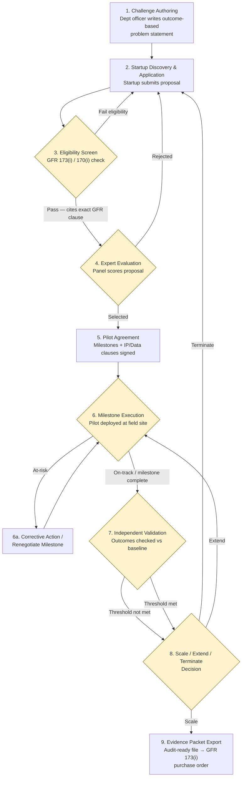
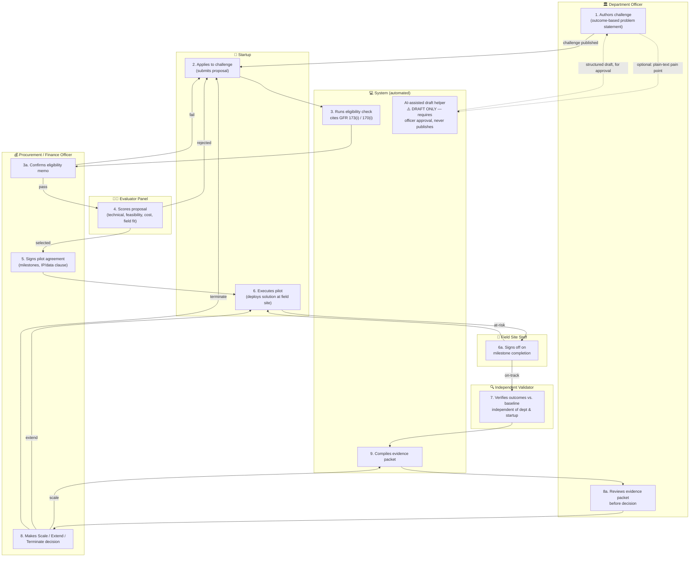

# PraGaTi Setu — End-to-End Workflow Specification
### PS 26136: Startup-Friendly Public Procurement (Government of Maharashtra)

This document defines the validated 9-stage workflow at three levels of detail: a high-level flowchart with decision logic, a swimlane view by actor, and a detailed stage-by-stage table. Use this as the single source of truth before writing any code.

---

## 1. High-Level Flowchart

**Reading notes:**
- Diamonds are the five decision points named in the brief: eligibility, evaluation, milestone status, validation, and scale decision.
- "Terminate" and "Reject" both loop back to stage 2 (Discovery) rather than dead-ending — the department can re-open the challenge to other applicants.
- "Extend" loops back into stage 6 (Milestone Execution), not into a new pilot agreement, unless the finance officer decides the terms themselves need renegotiation (handled as a manual off-diagram step).
- No AI node appears in this flowchart — see the swimlane diagram for where the optional AI drafting assistant sits, deliberately outside the decision path.

---

## 2. Swimlane Diagram (by Actor)

**Handoff notes:**
- **DO → SU**: a published challenge is the only handoff between the officer and the startup at intake — no informal contact.
- **SU → SYS → FIN**: eligibility is machine-checked first (citing the rule), then human-confirmed by the finance officer — the system never has final say.
- **EVAL → FIN**: the evaluator panel decides selection; the finance officer only re-enters at contracting (stage 5), not at evaluation, to keep technical and financial sign-off separate.
- **FS is a distinct lane from SU**: milestone sign-off is done by the field site, not self-reported by the startup — this is the check that prevents vendor-only reporting.
- **VAL is fully separate from DO, SU, and FIN**: the independent validator reports outcomes into the evidence packet before the finance officer ever sees it, preserving independence.
- **SYSAI sits off the main path**, connected only to the department officer's own stage, with dotted lines signaling it is optional and advisory — it cannot reach any decision node directly.

---

## 3. Detailed Stage Table

| # | Stage | Actor(s) | Trigger | Actions taken | Data created/consumed | System validation/check | Exit condition | Audit log entry |
|---|-------|----------|---------|----------------|------------------------|---------------------------|-----------------|------------------|
| 1 | Challenge Authoring | Department Officer (+ optional AI draft helper, advisory only) | Officer identifies an operational pain point with budget backing | Fills structured template: problem, baseline metric, target outcome, budget ceiling, timeline | Creates: challenge record, baseline metric, budget head, sector tag | Form-completeness check; template-conformance check | Officer digitally signs and publishes the challenge | Timestamped challenge record + officer sign-off |
| 2 | Startup Discovery & Application | Startup (DPIIT/MSInS-recognised) | Challenge is published and visible in registry | Startup reviews open challenges, submits structured proposal | Creates: application record, product specs, pricing, team details, prior-evidence (if any) | Auto-check of DPIIT recognition status against public registry; sector-tag match | Application submitted and queued | Application record with startup ID and timestamp |
| 3 | Eligibility Screen | System (auto-check) + Procurement/Finance Officer (confirms) | Application submitted | System checks incorporation date, turnover, DPIIT status against GFR 173(i)/170(i) criteria; generates eligibility memo naming the exact clause invoked | Creates: eligibility memo citing GFR 173(i) or 170(i); consumes: DPIIT certificate, incorporation/turnover self-declaration | Rule-citation engine maps applicant to the exact clause; officer reviews and confirms/overrides | Officer confirms memo — pass moves to evaluation, fail returns applicant to stage 2 with reason | Eligibility memo, clause cited, officer confirmation, timestamp |
| 4 | Expert Evaluation | Evaluator Panel (domain expert + technical evaluator + field-site representative) | Applicant passes eligibility screen | Panel scores proposal against fixed rubric: technical merit, feasibility, cost, field fit; each member declares conflict of interest | Creates: rubric scorecards, COI declarations | Weighted-scoring engine; consensus threshold check | Panel reaches consensus — selected moves to contracting, rejected returns applicant to stage 2 | Signed scorecards, panel composition, COI declarations on record |
| 5 | Pilot Agreement | Procurement/Finance Officer + Startup (using standard templates) | Proposal selected by panel | Both parties e-sign a milestone-based contract: payment tranches, data ownership terms, IP terms (default: startup retains core IP, dept gets licence to pilot outputs), cybersecurity clause, exit clause | Creates: signed contract, milestone definitions, metric baselines | Legal/finance sign-off checked against pre-cleared template version (not case-by-case drafting) | Contract signed by both parties | Signed contract, template version used, sign-off timestamp |
| 6 | Milestone Execution | Startup (deploys) + Field Site Staff (signs off) | Pilot agreement signed | Startup deploys solution at field site against agreed milestones; field-site supervisor confirms each milestone independently of the startup's own reporting | Creates: usage logs, milestone completion evidence, field-staff acknowledgement | Milestone sign-off requires field-site supervisor confirmation, not startup self-report alone | On-track → milestone payment released, proceeds to validation; at-risk → corrective action loop, re-attempt milestone | Milestone completion record, field-staff sign-off, payment-release timestamp |
| 7 | Independent Validation | Independent Validator (empanelled, external to dept and startup) | Milestone(s) marked complete and on-track | Validator measures actual outcomes against the challenge's original baseline and target, independently of vendor-reported figures | Creates: verified outcome metrics; consumes: vendor-reported metrics for comparison | Validator checklist; discrepancy flag if vendor and validator numbers diverge beyond tolerance | Validator signs off — result (threshold met or not met) passed to evidence compilation regardless of outcome | Validator's signed report, discrepancy flag (if any), timestamp |
| 8 | Scale / Extend / Terminate Decision | Department Head + Procurement/Finance Officer (reviewing evidence packet) | Independent validation complete | Officer and finance reviewer examine full evidence packet against the pre-agreed success/failure thresholds set in stage 1 | Consumes: full evidence packet (stages 1–7) | Decision checked against pre-agreed numeric thresholds, not ad hoc judgment | Scale → purchase order issued citing GFR 173(i); extend → returns to stage 6; terminate → returns to stage 2 | Decision memo, thresholds applied, rationale, decision-maker sign-off |
| 9 | Evidence Packet Export | System (automated compilation) | Decision recorded at stage 8, or on-demand for audit | Compiles the full timestamped trail from stages 1–8 into one exportable, immutable file | Consumes: all prior stage records; creates: single archived export | Export completeness check (no missing stage record) | File archived and available to department/CAG/local fund audit on request | Immutable, hash-referenced archive entry |

---

### Design constraints honored
- **No AI decision-making**: the only AI-touched node (`SYSAI`) is explicitly draft-only, sits outside the decision path in the swimlane diagram, and cannot publish or approve anything — the officer always signs.
- **GFR clause traceability**: stage 3 explicitly names GFR 173(i) or 170(i) as the cited clause, not a generic pass/fail.
- **Validator independence**: stage 7 is its own swimlane (`VAL`), structurally separate from both `DO` (department) and `SU` (startup).
- **Plain language**: node labels avoid technical jargon so a non-technical official can follow the diagrams unassisted.
